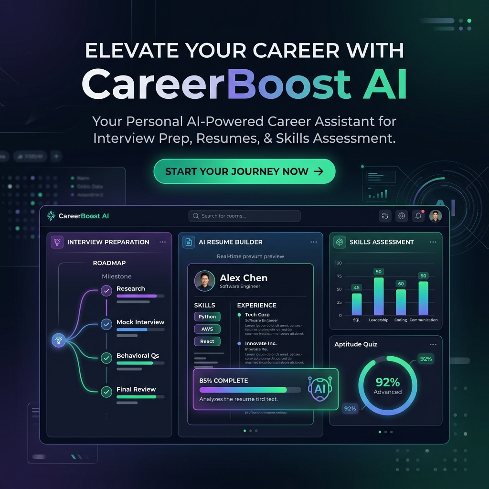
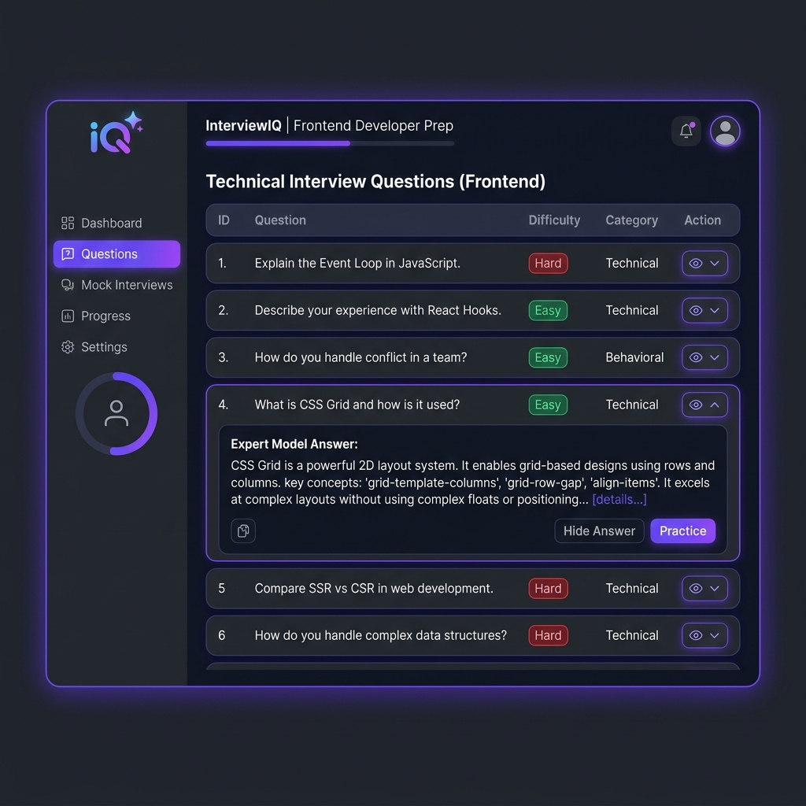
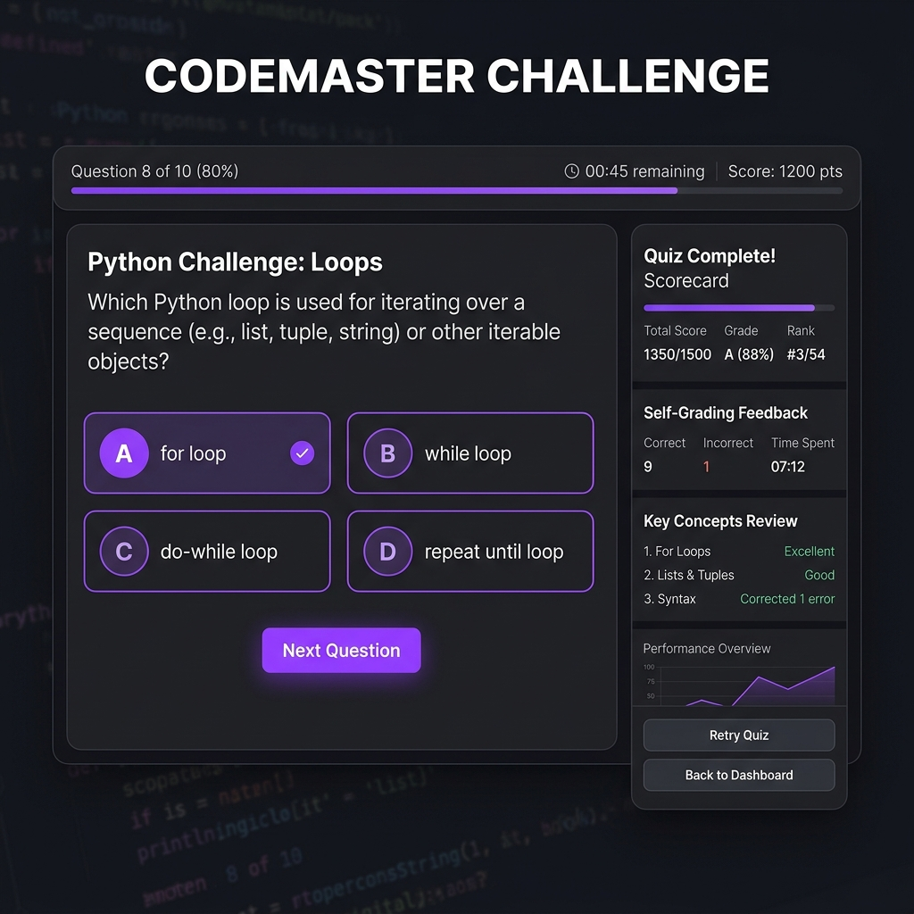
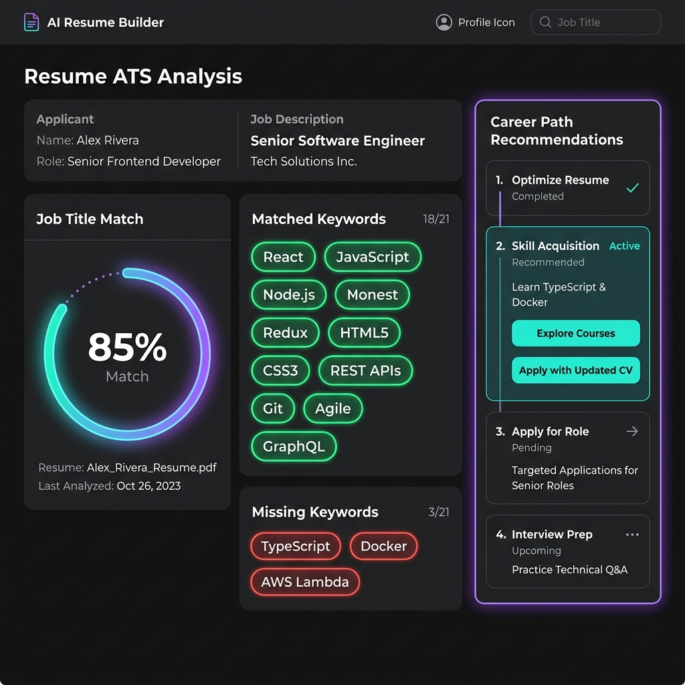
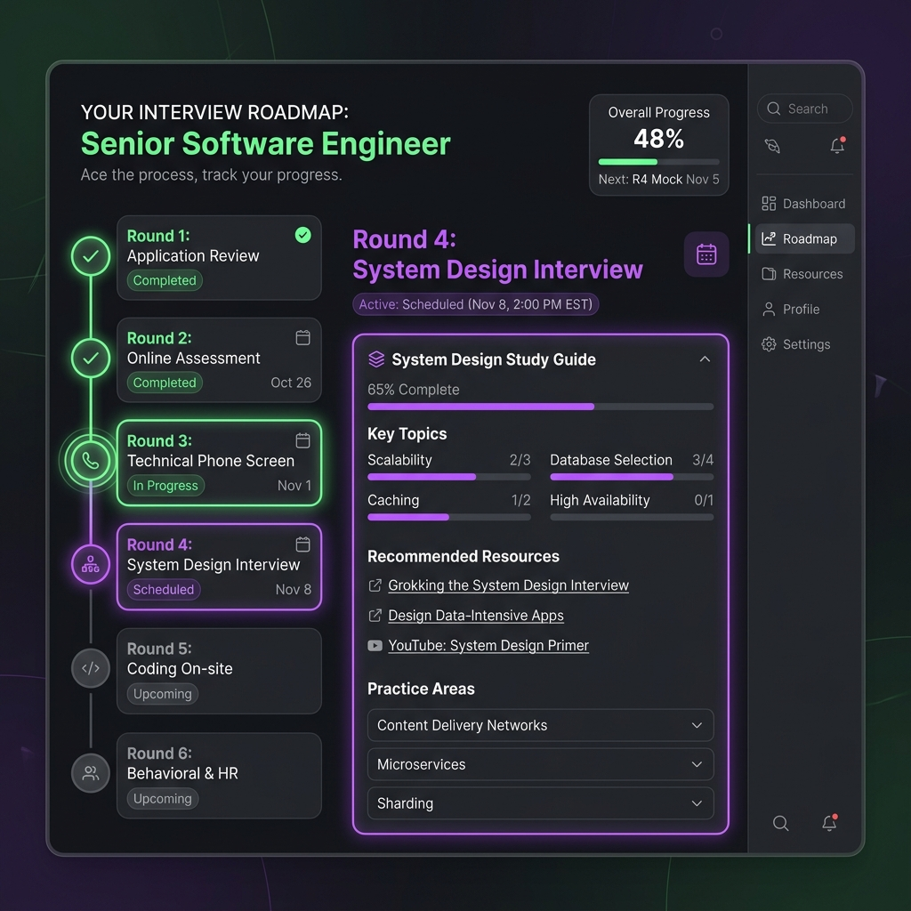

# 🚀 CareerBoost AI

An advanced, AI-powered career preparation platform designed to help students and job seekers prepare for interviews, master technical concepts, and optimize their resumes to beat Applicant Tracking Systems (ATS).

---

## ✨ Features

### 1. 🎤 Realistic AI Interview Prep
* **Role-Specific Generation**: Instantly generates up to 50 extremely realistic technical and behavioral interview questions tailored to any job role (e.g., Software Engineer, Product Manager, Full Stack Developer).
* **Resume Customization**: Upload your resume (PDF) to personalize generated questions based on your actual work history and skills.
* **Expert Answers & Guidelines**: Study ideal model answers and structured rubrics for every generated question.

---

### 2. ✏️ Interactive Quiz Mode
* **Knowledge Retrieval**: Converts study questions into interactive mock quizzes (20–30 questions).
* **Mixed Format**: Combines Multiple Choice Questions (MCQs), Fill-in-the-Blanks, and Short Answer questions.
* **Self-Graded Scorecard**: Compare your short answers side-by-side with AI expert guidance and self-grade correct/incorrect responses to update your accuracy percentage live!

---

### 3. 🎯 AI Resume Builder & ATS Scorecard
* **ATS Score Optimizer**: Paste a target job description and let the AI grade your resume details, calculating an overall match score shown on an animated SVG progress ring.
* **Keyword Matching**: Visualizes matched keywords (green badges) and missing critical keywords (red badges) required to pass resume screens.
* **⚡ AI Tailor**: Re-write specific work experience or project bullets in one click using action verbs, target keywords, and quantified metrics.
* **Premium Theme Selector**: Choose between multiple modern templates, including the elegant corporate **Executive Theme** (serif) and terminal-style **DevTech Dark Theme** (monospace).

---

### 4. 🗺️ Interactive Interview Roadmaps
* **Milestone Rounds**: Generates structured, round-by-round interview milestones specific to major target roles.
* **Expandable Guide Nodes**: Expand each round to reveal core focus areas, study cheat sheets, and round-specific quiz practice tabs.

---

## 🛠️ Technology Stack
* **Core**: HTML5, Vanilla CSS3 (Custom properties/vars, dark theme defaults).
* **Scripting**: Vanilla JavaScript (ES6+, DOM API, SpeechSynthesis, WebkitSpeechRecognition).
* **AI Engine**: Groq API (Primary — Llama 3.3 70B) & Gemini API (Fallback — Gemini 2.0 Flash) for blazing-fast responses.

---

## 🚀 Getting Started

### Prerequisites
To use the AI generation features, you will need a free API key:
* Get a free, ultra-fast key from **[Groq Console](https://console.groq.com)** (recommended).
* Or get a free key from **[Google AI Studio](https://aistudio.google.com)**.

### Running Locally
1. Clone this repository or download the files.
2. Launch a local web server (to prevent browser policy errors when loading scripts):
   * **Windows**: Double-click `START-SERVER.bat` in the root folder.
   * **Command Line (Python)**: Run `python -m http.server 8000` in the directory.
3. Open your browser and go to **`http://localhost:8000`**.
4. Click the **🔑 API Key** button in the navbar, paste your key, and start preparing!
